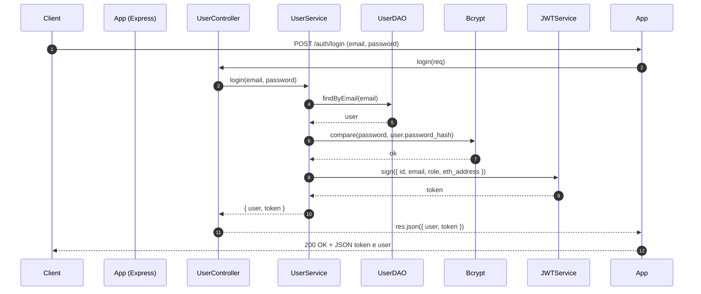
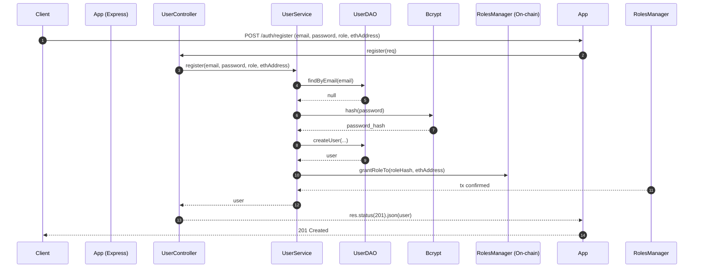
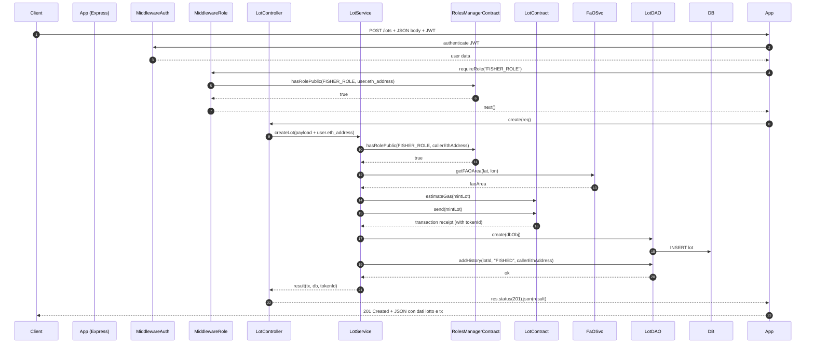
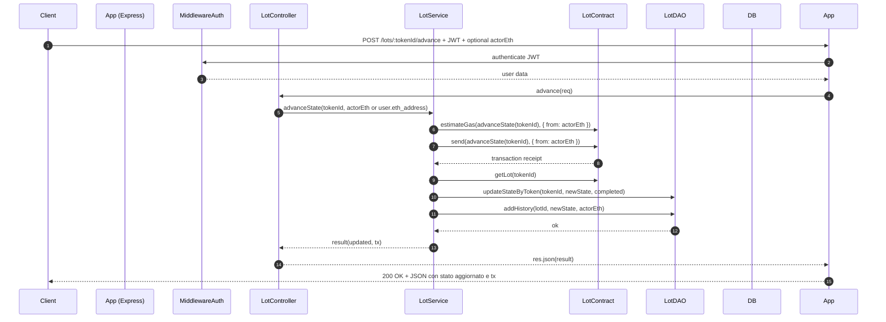
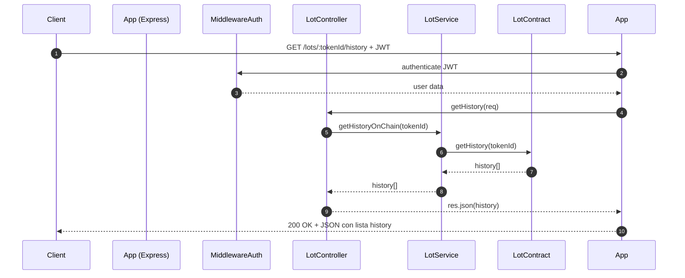

# FishLot Traceability API
# Descrizione del Progetto

**FishLot** è una piattaforma blockchain-based per la tracciabilità della filiera ittica.  
Consente agli utenti registrati di creare lotti di pesce certificati (NFT), avanzare gli stati di lavorazione e monitorare la storia del prodotto attraverso un sistema decentralizzato che integra smart contract, un database tradizionale e API REST sicure con autenticazione JWT.

---

# Tabella delle Rotte API

| Metodo | Rotta                       | Parametri                             | Descrizione                          |
|--------|-----------------------------|-------------------------------------|------------------------------------|
| POST   | /auth/register              | email, password, role, ethAddress   | Registrazione utente e assegnazione ruolo on-chain |
| POST   | /auth/login                 | email, password                     | Login e generazione token JWT      |
| POST   | /users                     | email, password, role, ethAddress   | Creazione utente (solo admin)      |
| GET    | /users                     | Nessuno                            | Lista utenti (autenticato)         |
| GET    | /users/:id                 | id (path)                         | Dettaglio utente                   |
| PUT    | /users/:id                 | id (path), role                     | Aggiornamento ruolo utente         |
| DELETE | /users/:id                 | id (path)                         | Eliminazione utente                 |
| POST   | /lots                      | species, quantity, lat, lon, vessel | Creazione lotto (FISHER_ROLE)      |
| POST   | /lots/:tokenId/advance     | tokenId (path), actorEth (opzionale) | Avanzamento stato lotto            |
| GET    | /lots/:tokenId             | tokenId (path)                    | Dettaglio lotto                    |
| GET    | /lots/:tokenId/history     | tokenId (path)                    | Cronologia stati lotto (on-chain) |

---


## Funzionamento del Progetto

Di seguito viene descritto il funzionamento delle principali rotte API del progetto **FishLot Traceability**, con esempi di richieste, risposte e meccanismi sottostanti.

---


## POST: `/auth/login`

Questa rotta consente al client di **autenticarsi** e ricevere un **token JWT** per autorizzare le chiamate successive.

---

### Richiesta

```http
POST /auth/login
Content-Type: application/json
```


```json
{
  "email": "user@example.com",
  "password": "password123"
}
```

### Meccanismo

Il flusso di registrazione segue i seguenti passaggi:
 - Ricerca utente tramite email nel database
 - Verifica della password confrontando l’hash con bcrypt
 - Se validi, genera un token JWT con payload contenente id, email, ruolo e indirizzo eth
 - Restituisce il token e i dati utente (senza la password)



### Risposta in caso di successo

```json
{
  "user": {
    "id": 1,
    "email": "user@example.com",
    "role": "FISHER_ROLE",
    "ethAddress": "0xAbC1234567890abcdef1234567890abcdef1234"
  },
  "token": "eyJhbGciOiJIUzI1NiIsInR5cCI6IkpXVCJ9..."
}
```

---

### Risposte in caso di errore

#### 400 – Email o password mancanti o errati
```json
{
  "error": "Credenziali errate"
}
```

#### 400 – Utente non trovato
```json
{
  "error": "Utente non trovato"
}
```

#### 500 – Errore interno server
```json
{
  "error": "Errore interno del server"
}
```


---

## POST: `/users`

Questa rotta consente la **registrazione di un nuovo utente** e l’**assegnazione del ruolo on-chain** tramite smart contract `RolesManager`.

---

### Richiesta

```http
POST /users
Authorization: Bearer <JWT>
```

```json
{
  "email": "user@example.com",
  "password": "password123",
  "role": "FISHER_ROLE",
  "ethAddress": "0xAbC1234567890abcdef1234567890abcdef1234"
}
```

---

### Meccanismo

Il flusso di registrazione segue i seguenti passaggi:

- Validazione dell’indirizzo Ethereum (`ethAddress`)
- Verifica che l’email non sia già registrata
- Hash sicuro della password tramite **bcrypt**
- Creazione dell’utente nel database relazionale
- Assegnazione del ruolo **on-chain** tramite smart contract `RolesManager`
- Restituzione dei dati utente creati


---

###  Diagramma di sequenza



---

### Risposta in caso di successo

```json
{
  "id": 1,
  "email": "user@example.com",
  "role": "FISHER_ROLE",
  "eth_address": "0xAbC1234567890abcdef1234567890abcdef1234"
}
```

---

### Risposte in caso di errore

#### 400 – Indirizzo Ethereum non valido
```json
{
  "error": "Indirizzo Ethereum non valido"
}
```

#### 400 – Email già registrata
```json
{
  "error": "Email già registrata"
}
```

#### 403 – Ruolo non assegnabile on-chain
```json
{
  "error": "AccessControl: account is missing role"
}
```

#### 500 – Errore blockchain o server
```json
{
  "error": "Errore interno del server"
}
```

---

## POST: `/lots`

Questa rotta permette a un utente con ruolo `FISHER_ROLE` di creare un nuovo lotto di pesce sulla blockchain e salvarlo nel database.

---

### Richiesta

```http
POST /lots
Content-Type: application/json
Authorization: Bearer <token_jwt>
```

```json
{
  "species": "Tuna",
  "quantity": 100,
  "lat": 45.4642,
  "lon": 9.1900,
  "vessel": "VesselName"
}
```

### Meccanismo

- Il flusso di registrazione segue i seguenti passaggi:

- Middleware auth verifica il token JWT e decodifica i dati utente

- Middleware requireRole("FISHER_ROLE") controlla che l'utente abbia il ruolo on-chain

- Controller riceve i dati e aggiunge l'indirizzo Ethereum dell'utente (dal token)

- Service:

-- Verifica la validità dell’indirizzo Ethereum

-- Controlla il ruolo on-chain FISHER_ROLE

-- Calcola l’area FAO dalla latitudine e longitudine

-- Stima il gas necessario e invia la transazione di minting NFT on-chain

-- Recupera il tokenId dall’evento della transazione

-- Salva il lotto nel database

-- Registra la storia (history) associata

- Restituisce dati di transazione, database e tokenId



### Risposta in caso di successo

```json
{
  {
  "tx": {
    "transactionHash": "0x123abc...",
    "events": {
      "Transfer": {
        "returnValues": {
          "tokenId": "42"
        }
      }
    }
  },
  "db": {
    "id": 1,
    "token_id": 42,
    "owner_eth_address": "0xAbC1234567890abcdef1234567890abcdef1234",
    "species": "Tuna",
    "quantity": 100,
    "coordinates_or_area": "27.4.a",
    "vessel": "VesselName",
    "state": "FISHED",
    "completed": false
  },
  "tokenId": 42
}

}
```

---

### Risposte in caso di errore

#### 400 – Dati mancanti o invalidi
```json
{
   "error": "callerEthAddress non valido o mancante"
}
```

#### 403 – Ruolo on-chain non assegnato
```json
{
  "error": "L'account non ha il ruolo FISHER_ROLE"
}
```

#### 500 – Errore interno server o blockchain
```json
{
  "error": "Errore nella transazione blockchain"
}
```

---

## POST: `/lots/:tokenId/advance`

Questa rotta permette a un utente con il ruolo on-chain corrispondente di avanzare lo stato di un lotto specifico della filiera ittica.

---

### 📥 Richiesta

```http
POST /lots/42/advance
Content-Type: application/json
Authorization: Bearer <token_jwt>
```

### Meccanismo
- Middleware auth verifica il token JWT e decodifica i dati utente
- Controller riceve tokenId e actorEth (da body o JWT)
- Service:
-- Verifica la validità dell’indirizzo Ethereum actorEth
-- Stima il gas necessario e invia la transazione on-chain advanceState(tokenId) usando l’actorEth come sender
-- Recupera lo stato aggiornato on-chain e aggiorna il record nel database
-- Aggiunge una voce di storia (history) associata allo stato avanzato
- Restituisce i dati aggiornati e la transazione



### Risposta in caso di successo

```json
{
  {
  "updated": {
    "id": 1,
    "token_id": 42,
    "state": "PROCESSING",
    "completed": false
  },
  "tx": {
    "transactionHash": "0xabc123...",
    "events": {
      "StateAdvanced": {
        "returnValues": {
          "tokenId": "42",
          "newState": "PROCESSING",
          "actor": "0x1234567890abcdef1234567890abcdef12345678"
        }
      }
    }
  }
}

}
```

---

### Risposte in caso di errore

#### 400 – Dati mancanti o invalidi
```json
{
   "error": "actorEthAddress non valido o mancante"
}
```

#### 500 – Errore interno server o blockchain
```json
{
  "error": "Errore nella transazione blockchain"
}
```

---

## GET: `/lots/:tokenId/history`

Questa rotta restituisce la cronologia degli stati (history) di un lotto specifico, recuperata on-chain.

---

### Richiesta

```http
GET /lots/42/history
Authorization: Bearer <token_jwt>
```

### Meccanismo

- Middleware auth verifica il token JWT e decodifica i dati utente

- Controller riceve il tokenId dalla URL

- Service richiama il contratto blockchain per ottenere la cronologia degli stati (getHistory(tokenId))

- Restituisce la cronologia degli eventi (stati, timestamp, attori)



### Risposta in caso di successo

```json
{
  {
  "tokenId": 42,
  "lot": {
    "id": 42,
    "species": "Tuna",
    "quantity": 150,
    "area": "27.8.b",
    "vessel": "FishingBoat01",
    "stateIndex": 2,
    "state": "DISTRIBUTING",
    "completed": false
  },
  "history": [
    {
      "stepIndex": 0,
      "state": "FISHED",
      "timestamp": 1690000000,
      "actor": "0xabc123..."
    },
    {
      "stepIndex": 1,
      "state": "PROCESSING",
      "timestamp": 1690005000,
      "actor": "0xdef456..."
    },
    {
      "stepIndex": 2,
      "state": "DISTRIBUTING",
      "timestamp": 1690010000,
      "actor": "0x123789..."
    }
  ]
}


}
```

---

### Risposte in caso di errore

#### 400 – Parametro tokenId non valido
```json
{
  "error": "tokenId non valido"
}
```

#### 404 – Lotto non trovato
```json
{
  "error": "Not found"
}
```

#### 500 – Errore interno server
```json
{
  "error": "Errore del server"
}
```