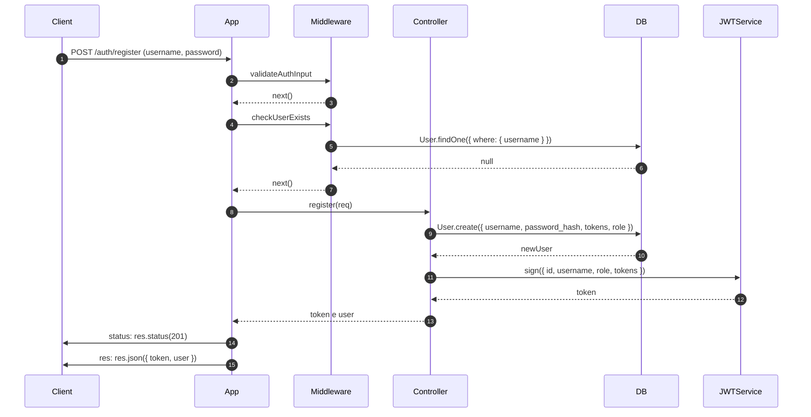

## Funzionamento del Progetto

Di seguito viene descritto il funzionamento delle principali rotte API del progetto **VoidTracks**, con esempi di richieste, risposte e meccanismi sottostanti.

### POST: /auth/register

**Richiesta**

Il corpo della richiesta deve seguire il modello JSON:
```json
{
  "username": "nuovoUtente",
  "password": "nuovaPassword"
}
```

**Meccanismo**

Il meccanismo è il seguente:
- Valida i dati ricevuti (username e password).
- Verifica che l’username non sia già registrato.
- Applica un hash sicuro alla password tramite bcrypt.
- Crea un nuovo utente con ruolo user e saldo iniziale di token (10).
- Genera un token JWT contenente id, username, ruolo e token residui.
- Restituisce il token e i dati utente.

**Diagramma di sequenza**

Il meccanismo che si innesca all'atto della chiamata è descritto dal seguente diagramma:



**Risposta in caso di successo**

La risposta restituisce il token e i dati utente.

```json
{
  "token": "eyJhbGciOiJSUzI1NiIsInR5cCI6IkpXVCJ9...",
  "user": {
    "id": 10,
    "username": "nuovoUtente",
    "role": "user",
    "tokens": 10
  }
}
```

**Risposta in caso di errore**

Se username o password sono assenti o non validi, viene restituito un errore con codice **400** e una lista di messaggi strutturati:

```json
{
  "errors": [
    {
      "msg": "Bad Request: Username obbligatorio, almeno 3 caratteri",
      "param": "username",
      "location": "body"
    },
    {
      "msg": "Bad Request: Password obbligatoria, almeno 6 caratteri",
      "param": "password",
      "location": "body"
    }
  ]
}
```
Se solo uno dei due campi è errato, la risposta conterrà solo l’errore corrispondente.

Se l'username fornito è già presente nel database, viene restituito un errore con codice **409** e un messaggio descrittivo:

```json
{
  "error": "Conflict: Username già in uso"
}
```

Per altri errori lato server viene restituito un errore con codice **500** e un messaggio generico:
```json
{
  "error": "Errore del server"
}
```